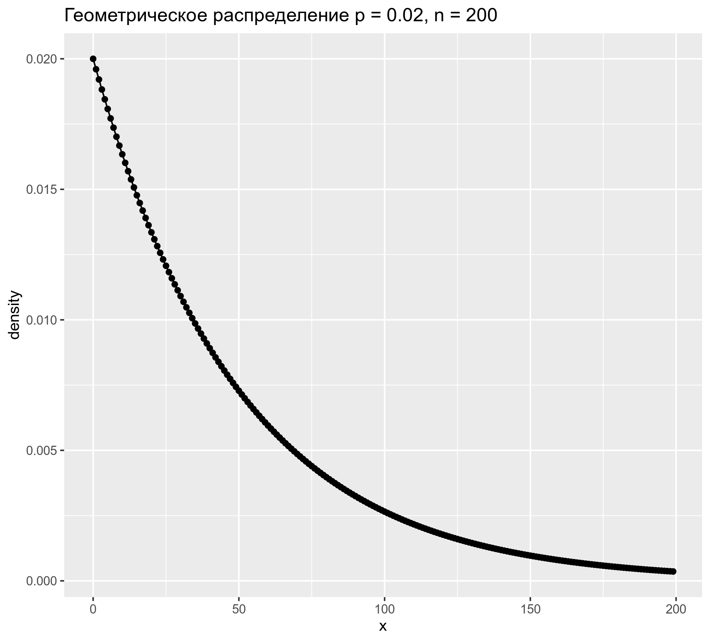
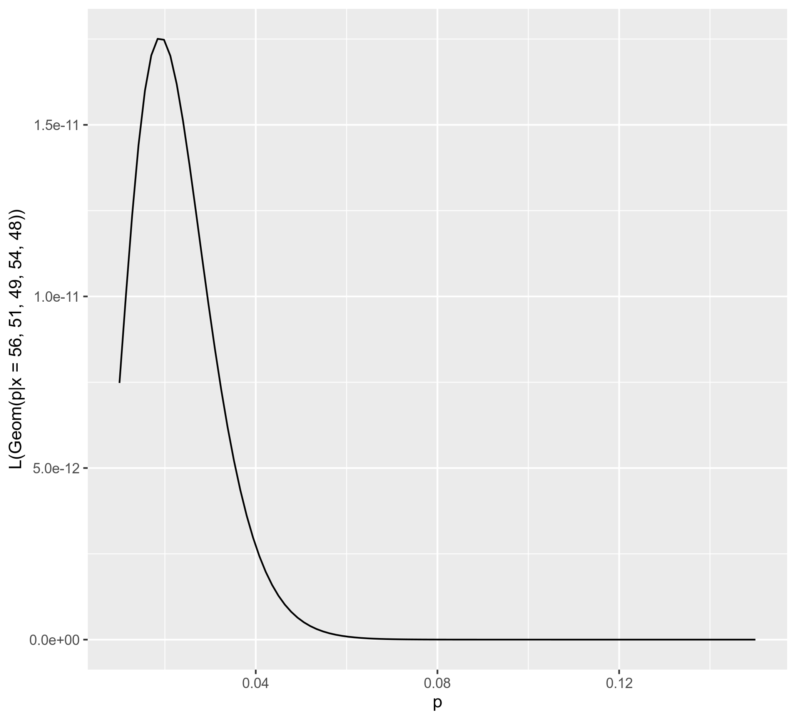

```{r, message=FALSE}
library(tidyverse)
```


## task 2.1.1

Согласно базе данных [PHOIBLE](https://phoible.org/) звонкий фарингальный фрикативный ʕ встречается лишь в 2% инвентарей. Предположим, что кто-то решил рандомно выбирать грамматики из большой библиотеки, где все книги отсортированы по алфавиту. Какова вероятность что будут просмотрены 43 грамматики, но звонкий фарингальный фрикативный так и не будет найден? Ответ округлите до 3 знаков после запятой. Помните, что геометрическое распределение в точке ноль сообщает вероятность успеха при первом эксперименте Бернулли.

```{r}
# put here your solution
```

## task 2.1.2

Нарисуйте график показывающий распределение вероятностей просмотреть от одной до двухсот грамматик и так и не найти ʕ. 

```{r}
# put here your solution
```



## task 2.1.3

Посчитайте вероятность найти ʕ в промежутке между 41-ой и 61-ой грамматиками. Ответ округлите до 3 знаков после запятой.

```{r}
# put here your solution
```

## task 2.1.4

Визуализируйте функцию правдоподобия моделей геометрического распределения с параметрами p от 0.01 до 0.15 с шагом 0.01 для данных 56, 51, 49, 54, 48 (количество неудач до первого успеха).

```{r}
# put here your solution
```



## task 2.2

В датасет `letter_frequency.csv` записаны частотности встречаемости букв разных языков. Проведите байесовский апдейт, используя в качестве данных слово "most" и считая, что все языки равновероятны. Посчитайте апостериорную вероятность и выведите в консоль язык с максимальной апостериорной вероятностью.

```{r}
# put here your solution
```
